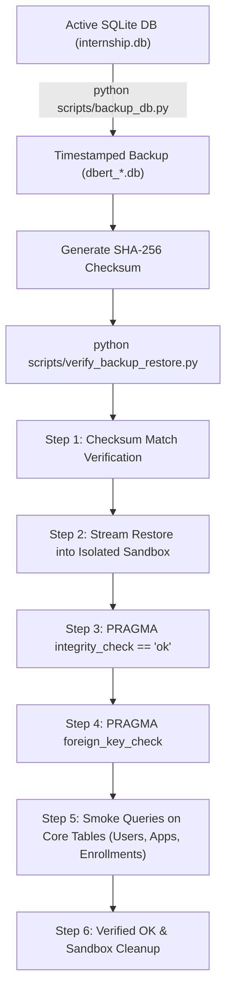

# DBERT Internship Portal — Database Safety & Backup Policy (SAFE-002)

**Document Date:** 2026-09-23  
**Status:** Mandatory Production Operational Standard  

---

## 1. Executive Directive on Database Safety

The DBERT Internship Portal operates a live production environment with thousands of registered candidates, hundreds of active enrollments, and critical academic records. 

> **Golden Rule**: A backup is considered non-existent until its restoration has been verified in an isolated environment with zero integrity errors.

---

## 2. Backup Strategy & Schedules

### 2.1 Cadence & Triggers
1. **Daily Scheduled Backup**: Executed automatically at 02:00 UTC via system cron.
2. **Pre-Release Backup**: Mandatory before deploying any code change to staging or production.
3. **Pre-Migration Backup**: Mandatory before running any schema migration, backfill script, or data transformer.
4. **Emergency / Manual Backup**: On-demand prior to manual database interventions.

### 2.2 Storage & Naming Standard
- **Location**: `backups/`
- **Naming Pattern**: `dbert_YYYY_MM_DD_HH_MM_SS.db`
- **Companion Checksum**: `dbert_YYYY_MM_DD_HH_MM_SS.db.sha256`
- **Manifest**: `backups/backup_manifest.json`

### 2.3 Online, Zero-Downtime Backup Execution
Direct OS file copying (`cp` or `copy`) of an active SQLite database operating in WAL (Write-Ahead Logging) mode can cause page tearing or capture uncheckpointed transactions.
All backups must be created using SQLite's online backup API:
```powershell
python scripts/backup_db.py --reason [pre-release|pre-migration|daily|manual|emergency]
```

---

## 3. Restoration & Verification Procedure

Every backup must pass automated verification prior to being certified:



### 3.1 Verification Command
To verify the latest backup:
```powershell
python scripts/verify_backup_restore.py --latest
```

To verify a specific historical backup:
```powershell
python scripts/verify_backup_restore.py --backup backups/dbert_YYYY_MM_DD_HH_MM_SS.db
```

---

## 4. Emergency Database Restoration Runbook

If production database corruption or accidental truncation occurs:

1. **Immediately Halt Application Traffic**:
   ```bash
   sudo systemctl stop internship.service
   ```
2. **Identify the Last Known Verified Backup**:
   Check `backups/backup_manifest.json` for the most recent entry with `"status": "VERIFIED_OK"`.
3. **Verify the Selected Backup**:
   ```powershell
   python scripts/verify_backup_restore.py --backup backups/<chosen_backup>.db
   ```
4. **Preserve Current Corrupted Database for Forensics**:
   ```bash
   mv internship.db internship.db.corrupt.$(date +%s)
   ```
5. **Restore the Verified Backup**:
   ```bash
   cp backups/<chosen_backup>.db internship.db
   ```
6. **Restart Application & Run Smoke Checks**:
   ```bash
   sudo systemctl start internship.service
   curl -f http://127.0.0.1:5000/health
   ```
